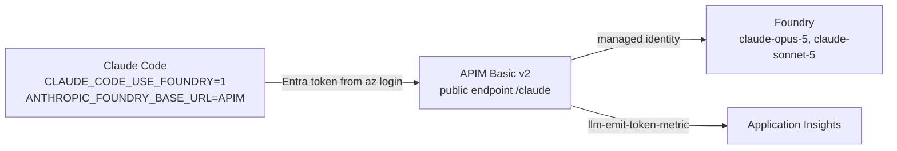
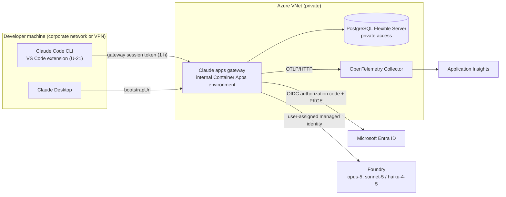
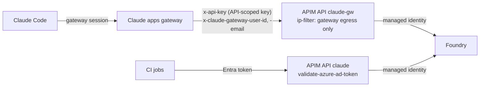

# Architecture — routes from Claude Code to Claude in Microsoft Foundry

Five routes appear in this plan. Route A runs today; A2 adds endpoint-managed settings to it; B and C
are piloted; D is the measurement baseline.

| Route | Path | Role in this plan |
|---|---|---|
| A | Claude Code → APIM → Foundry | Current production route; stays in place during the pilot and for CI |
| A2 | Route A plus endpoint-managed settings from the accelerator | Policy-delivery baseline, packet P-17 |
| B | Claude Code → Claude apps gateway → Foundry | Pilot, packets P-2 to P-14 |
| C | Claude Code → Claude apps gateway → separate APIM API → Foundry | Experiment, packet P-15 |
| D | Claude Code → Foundry, developer's own Entra token | Latency and feature baseline for PS-6 and PS-7 only |

## Route A — current APIM gateway



| Fact | Evidence |
|---|---|
| APIM exposes `POST /v1/messages` and `POST /v1/messages/count_tokens` under `/claude`, with no subscription key | [claude-code-foundry-gateway@f237fb9:infra/main.bicep:153-186](https://github.com/naveenneog/claude-code-foundry-gateway/blob/f237fb98c23e285fac939af8ca5bfbc886d53c23/infra/main.bicep#L153-L186) |
| The deployed instance `apim-claude-gw-fzgql9` is Basic v2, capacity 1, East US 2, public network access, no VNet; gateway URL `https://apim-claude-gw-fzgql9.azure-api.net`, API `claude-foundry` at path `claude` with `subscriptionRequired: false` | `az apim list`, `az apim show` and `az apim api list`, 2026-09-23 |
| Clients authenticate with an Entra token from `DefaultAzureCredential`; APIM runs `validate-azure-ad-token` | [claude-code-foundry-gateway@f237fb9:infra/policy.xml:27-36](https://github.com/naveenneog/claude-code-foundry-gateway/blob/f237fb98c23e285fac939af8ca5bfbc886d53c23/infra/policy.xml#L27-L36) |
| Access tiers come from object-ID allowlists synced from Entra groups by `Sync-ClaudeAccess.ps1` | [claude-code-foundry-gateway@f237fb9:infra/policy.xml:16-19](https://github.com/naveenneog/claude-code-foundry-gateway/blob/f237fb98c23e285fac939af8ca5bfbc886d53c23/infra/policy.xml#L16-L19) ; [claude-code-foundry-gateway@f237fb9:infra/policy.xml:53-65](https://github.com/naveenneog/claude-code-foundry-gateway/blob/f237fb98c23e285fac939af8ca5bfbc886d53c23/infra/policy.xml#L53-L65) |
| Per-developer limits: tokens per minute and per day through `llm-token-limit`, 120 calls per minute | [claude-code-foundry-gateway@f237fb9:infra/policy.xml:82-124](https://github.com/naveenneog/claude-code-foundry-gateway/blob/f237fb98c23e285fac939af8ca5bfbc886d53c23/infra/policy.xml#L82-L124) |
| APIM calls Foundry with its managed identity (`Cognitive Services User`) and removes `x-api-key` | [claude-code-foundry-gateway@f237fb9:infra/policy.xml:140-147](https://github.com/naveenneog/claude-code-foundry-gateway/blob/f237fb98c23e285fac939af8ca5bfbc886d53c23/infra/policy.xml#L140-L147) |
| Any user in the `allow-standard` or `allow-premium` list passes, whatever other route the user has; P-12 removes migrated users | [claude-code-foundry-gateway@f237fb9:infra/policy.xml:53-65](https://github.com/naveenneog/claude-code-foundry-gateway/blob/f237fb98c23e285fac939af8ca5bfbc886d53c23/infra/policy.xml#L53-L65) |
| The allowlists are synced from the Entra groups `claude-code-standard` and `claude-code-premium`; the gateway uses its own groups, so P-12 can remove a user from APIM without ending gateway access | [claude-code-foundry-gateway@f237fb9:scripts/Sync-ClaudeAccess.ps1:34-35](https://github.com/naveenneog/claude-code-foundry-gateway/blob/f237fb98c23e285fac939af8ca5bfbc886d53c23/scripts/Sync-ClaudeAccess.ps1#L34-L35) ; [claude-code-foundry-gateway@f237fb9:scripts/Sync-ClaudeAccess.ps1:90-91](https://github.com/naveenneog/claude-code-foundry-gateway/blob/f237fb98c23e285fac939af8ca5bfbc886d53c23/scripts/Sync-ClaudeAccess.ps1#L90-L91) |
| Route A2: the accelerator writes a managed settings file whose `env` selects route A, with deny rules, `disableBypassPermissionsMode` and `allowManagedPermissionRulesOnly` | [claude-code-foundry-gateway@205a6cc:scripts/New-ClaudeCodePolicy.ps1:160-203](https://github.com/naveenneog/claude-code-foundry-gateway/blob/205a6ccc10fb45451afbd048d26884e6175ec8a3/scripts/New-ClaudeCodePolicy.ps1#L160-L203) |

## Route B — Claude apps gateway



Components and the packet that builds each:

| Component | Setting | Packet | Source |
|---|---|---|---|
| Linux runtime | Container Apps consumption environment with ingress limited to the tester for M1 (ADR-0003); internal Container Apps environment for P-10 | P-3, P-10 | https://code.claude.com/docs/en/claude-apps-gateway-deploy#container-image |
| Container image | Pinned Linux `claude` build verified against the signed `manifest.json`; `CLAUDE_CONFIG_DIR` writable; command `claude gateway --config /etc/claude/gateway.yaml` | P-3 | https://code.claude.com/docs/en/claude-apps-gateway-deploy#container-image |
| PostgreSQL | 16, dedicated database, role with DDL rights, `?sslmode=require` | P-3, P-10 | https://code.claude.com/docs/en/claude-apps-gateway-config#store |
| Identity provider | Entra app registration, redirect URI `<public_url>/oauth/callback`, `email` optional claim; gateway entitlement groups or app roles, separate from the APIM allowlist groups | P-2 | https://code.claude.com/docs/en/claude-apps-gateway-deploy#identity-provider-setup |
| Upstream credential | User-assigned managed identity with a Foundry data-plane role (U-22) | P-10 | https://code.claude.com/docs/en/claude-apps-gateway-config#microsoft-foundry |
| Secrets | `OIDC_CLIENT_SECRET`, `GATEWAY_JWT_SECRET`, `GATEWAY_POSTGRES_URL` from Key Vault into the container environment | P-10 | https://code.claude.com/docs/en/claude-apps-gateway-config#secret-expansion |
| Name and TLS | Private DNS zone record to the environment's private VIP; TLS at the ingress; `listen.trusted_proxies` set to the ingress range | P-10 | https://code.claude.com/docs/en/claude-apps-gateway-deploy#deployment |
| Probes | Liveness and readiness both `GET /healthz`, so during a store outage the gateway itself answers with 429 `spend limit unavailable` rather than leaving rotation (T-18) | P-10 | https://code.claude.com/docs/en/claude-apps-gateway-deploy#outage-behavior |
| Telemetry and audit logs | One Log Analytics workspace for the collector's metrics and the gateway's stderr audit events. The access mode requires workspace permissions; DataActionsOnly mode (preview) keeps Reader and Monitoring Reader from reading data; Log Analytics Data Reader goes only to the named reader group; `retentionInDays: 30` with `immediatePurgeDataOn30Days: true`; each Application Insights table, 90 days by default, set to `retentionInDays: 30` and `totalRetentionInDays: 30`; the subscription activity log is not routed here (T-35, T-39, T-40, T-41; U-28, U-29, U-30, U-31) | P-9, P-10 | https://learn.microsoft.com/en-us/azure/azure-monitor/logs/manage-access ; https://learn.microsoft.com/en-us/azure/azure-monitor/logs/data-retention-configure |
| PostgreSQL access and backups | Entra authentication for a named operator group (T-36); backup retention 7 days, which is how long an erased row stays restorable (U-27, T-37) | P-10 | https://learn.microsoft.com/en-us/azure/postgresql/backup-restore/concepts-backup-restore |

### Draft `gateway.yaml`

Values in `<>` are set per environment. Secrets come from environment variables. The draft uses only
keys available in 2.1.273, the newest build on this machine's npm feed; keys that need 2.1.274 or later
are added once P-3 confirms a newer Linux build (U-5). The M1 test deployment runs
`config/gateway.azure-test.yaml` instead: one upstream, the two models that upstream deploys, admission
by app role, and allow lists on the tester's range (ADR-0003).

```yaml
listen:
  host: 0.0.0.0                        # local: reached from Windows through WSL2 localhost forwarding (U-23)
  port: 8080
  public_url: http://localhost:8080    # azure: https://claude-gateway.<internal-domain>
  # trusted_proxies: [<ingress-subnet-cidr>]            # azure

oidc:
  issuer: https://login.microsoftonline.com/<tenant-id>/v2.0
  client_id: <app-client-id>
  client_secret: ${OIDC_CLIENT_SECRET}
  allowed_email_domains: [<email-domain>]
  groups_claim: groups                 # roles, when app roles carry the tiers (U-2, U-24)
  # Gateway entitlement groups, separate from the APIM allowlist groups claude-code-standard and
  # claude-code-premium, so that P-12 can remove a migrated user from APIM without ending gateway access.
  allowed_groups: [<gateway-standard-group-object-id>, <gateway-premium-group-object-id>]

session:
  jwt_secret: ${GATEWAY_JWT_SECRET}
  ttl_hours: 1

store:
  postgres_url: ${GATEWAY_POSTGRES_URL}

upstreams:
  - name: foundry-contosohub
    provider: foundry
    resource: ai-contosohub530569751908
    auth: { use_azure_ad: true }
  - name: foundry-claudepv2            # added in P-5
    provider: foundry
    resource: ai-claudepv2-4550
    auth: { use_azure_ad: true }

auto_include_builtin_models: false
models:
  # Built-in IDs are tried on every upstream in order; upstream_model changes the ID sent, not
  # whether an upstream is tried. A Haiku request therefore takes a 404 from foundry-contosohub
  # before foundry-claudepv2 serves it. P-5 measures the hop and records whether claude-haiku-4-5
  # is deployed on the first account instead.
  - id: claude-opus-5
    label: Claude Opus 5
    upstream_model: { foundry-contosohub: claude-opus-5 }
  - id: claude-sonnet-5
    label: Claude Sonnet 5
    upstream_model: { foundry-contosohub: claude-sonnet-5 }
  - id: claude-haiku-4-5
    label: Claude Haiku 4.5
    upstream_model: { foundry-claudepv2: claude-haiku-4-5 }

managed:
  policies:
    - match: { groups: [<gateway-premium-group-object-id>] }
      cli:
        availableModels: [claude-opus-5, claude-sonnet-5, claude-haiku-4-5]
    - match: {}
      cli:
        availableModels: [claude-sonnet-5, claude-haiku-4-5]
        enforceAvailableModels: true
        allowManagedPermissionRulesOnly: true
        permissions:
          deny: ["WebFetch"]
          disableBypassPermissionsMode: disable
        env:
          ANTHROPIC_DEFAULT_HAIKU_MODEL: claude-haiku-4-5   # background tasks otherwise use the main model
        # P-14 adds, here and in the managed settings file: parentSettingsBehavior: merge,
        # allowManagedMcpServersOnly, allowManagedHooksOnly, sandbox.network.allowManagedDomainsOnly,
        # sandbox.filesystem.allowManagedReadPathsOnly, and their allowlists.
      # desktop: {}                                        # P-14

# access_control:                                          # azure
#   allow_cidrs: [10.0.0.0/8, 172.16.0.0/12, 192.168.0.0/16, 100.64.0.0/10]
# admin:                                                   # P-8
#   write_keys: [{ id: pilot, key: "${GATEWAY_ADMIN_WRITE_KEY}" }]
#   identity_retention_days: 30
# enforcement: { fail_closed_on_error: true }              # P-8; needs admin:
# pricing: { overrides: [] }                               # P-8, rates from U-9
# telemetry:                                               # P-9
#   forward_to: [{ url: "https://<collector-host>:4318", metrics: true, logs: false, traces: false }]
```

Behaviour this draft relies on:

| Behaviour | Source |
|---|---|
| Unknown keys fail boot; every section is schema-checked at start | https://code.claude.com/docs/en/claude-apps-gateway-config#file-structure |
| A `models:` block maps canonical IDs to Foundry deployment names; each `upstream_model` key names an upstream | https://code.claude.com/docs/en/claude-apps-gateway-config#models |
| Built-in model IDs are tried on every upstream in order; only a custom ID skips the upstreams absent from its map | https://code.claude.com/docs/en/claude-apps-gateway-config#multiple-upstreams |
| Policies match on the first rule; other rules inherit keys they do not set from `match: {}`; deny lists merge as a union | https://code.claude.com/docs/en/claude-apps-gateway-config#managed |
| `availableModels` is enforced at `/v1/messages` with a 400 | https://code.claude.com/docs/en/claude-apps-gateway-config#managed |
| Gateway sessions send background tasks to the main model unless `ANTHROPIC_DEFAULT_HAIKU_MODEL` pins one | https://code.claude.com/docs/en/llm-gateway-protocol#requests-and-defaults-by-connection-method |
| A 404 from the first upstream fails over to the next | https://code.claude.com/docs/en/claude-apps-gateway-config#multiple-upstreams |
| With `fail_closed_on_error: true`, a store outage returns 429 `billing_error` "spend limit unavailable" | https://code.claude.com/docs/en/claude-apps-gateway-spend-limits#postgres-availability |
| `principal_emails` holds email, display name and groups for `identity_retention_days` after last activity | https://code.claude.com/docs/en/claude-apps-gateway-spend-limits#data-lifecycle |
| Logs and traces can carry Bash commands, tool inputs and file paths; each destination opts in per signal | https://code.claude.com/docs/en/claude-apps-gateway-config#telemetry |

### Client settings

Windows reads `C:\Program Files\ClaudeCode\managed-settings.json`, or the `Settings` value under
`HKLM\SOFTWARE\Policies\ClaudeCode`, which replaces the file when present
([managed settings](https://code.claude.com/docs/en/managed-settings)).

```json
{
  "forceLoginMethod": "gateway",
  "forceLoginGatewayUrl": "https://claude-gateway.<internal-domain>"
}
```

- Local runs (P-3, P-4) use `"forceLoginGatewayUrl": "http://localhost:8080"`.
- The P-13 migration removes the APIM route variables `CLAUDE_CODE_USE_FOUNDRY` and `ANTHROPIC_FOUNDRY_BASE_URL`, both from user environments and from the accelerator's managed file, because a provider variable skips the gateway sign-in (U-16).
- `parentSettingsBehavior: "merge"` is left out until P-14. Machines that sign in through `/login` do not need it; Claude Desktop's embedded sessions do. Once set, a host process can add allow rules and sandbox allowlists unless the five `allowManaged*Only` locks are set, so P-14 adds the setting and the locks together, in this file and in the catch-all `cli` block ([deliver policy to Claude Desktop sessions](https://code.claude.com/docs/en/claude-apps-gateway#deliver-policy-to-claude-desktop-sessions), [restrict parent settings](https://code.claude.com/docs/en/claude-apps-gateway#restrict-parent-settings)).
- A leftover `apiKeyHelper`, `ANTHROPIC_API_KEY` or `ANTHROPIC_AUTH_TOKEN` stops startup with "Administrator policy requires a Cloud gateway sign-in on this machine" ([troubleshooting](https://code.claude.com/docs/en/claude-apps-gateway-deploy#troubleshooting)).
- Claude Desktop reads `bootstrapUrl` = `https://claude-gateway.<internal-domain>/user/bootstrap` from its own managed configuration ([Claude Desktop overlay](https://code.claude.com/docs/en/claude-apps-gateway-config#claude-desktop-overlay)).
- On networks that block `api.anthropic.com`, `CLAUDE_CODE_DISABLE_NONESSENTIAL_TRAFFIC=1` and `skipWebFetchPreflight: true` stop the remaining client calls to Anthropic ([compliance posture](https://code.claude.com/docs/en/claude-apps-gateway-deploy#compliance-posture)).

## Route C — Claude apps gateway in front of a separate APIM API



The gateway keeps sign-in, per-group policy, Claude Desktop and OTLP telemetry; APIM keeps
tokens-per-minute limits, LLM logs, chargeback queries and the CI entry point. The current `claude`
API accepts only Entra bearer tokens, so route C adds a second API, `claude-gw`, with its own controls:

| Control on `claude-gw` | Setting | Test |
|---|---|---|
| Caller authentication | `subscriptionRequired: true`, subscription key header renamed to `x-api-key`, one API-scoped subscription whose key the gateway reads from Key Vault | T-28 |
| Caller address | `ip-filter` allowing only the gateway's egress address (U-26) | T-28 |
| Identity | `x-claude-gateway-user-id` required; `llm-token-limit` counters keyed on it, not on email; `x-gateway-user` set from `x-claude-gateway-user-email` | T-24, T-29 |
| Key hygiene | `x-api-key` deleted before the request goes to Foundry, as on the `claude` API | T-28 |
| Spoofing on the direct API | The `claude` API deletes any incoming `x-claude-gateway-*` header and keeps using the token's `oid` | T-29 |

```yaml
upstreams:
  # The only upstream. The gateway fails over on 401, 403, 404, 429 and 5xx, so a Foundry upstream
  # listed here would serve requests that APIM refused, such as the daily-quota 403 (T-24).
  - name: apim
    provider: anthropic
    base_url: https://apim-claude-gw-fzgql9.azure-api.net/claude-gw
    auth:
      api_key: ${APIM_GATEWAY_KEY}       # the API-scoped subscription key
    forward_user_identity: true          # adds x-claude-gateway-user-id and -email
```

| Constraint | Source |
|---|---|
| `forward_user_identity` exists only on `provider: anthropic` upstreams whose `base_url` is a proxy the operator runs | https://code.claude.com/docs/en/claude-apps-gateway-config#per-user-identity-headers-for-a-proxy-you-run |
| A proxy 429 on a request that carried the developer's email is returned as-is, without failover; other 4xx listed above fail over | https://code.claude.com/docs/en/claude-apps-gateway-config#multiple-upstreams |
| The subscription key header name is set per API; a subscription can be scoped to one API | https://learn.microsoft.com/en-us/azure/api-management/api-management-subscriptions |
| `ip-filter` applies to all APIM tiers | https://learn.microsoft.com/en-us/azure/api-management/ip-filter-policy |
| The current `claude` API rejects requests without a valid Entra token | [claude-code-foundry-gateway@f237fb9:infra/policy.xml:27-36](https://github.com/naveenneog/claude-code-foundry-gateway/blob/f237fb98c23e285fac939af8ca5bfbc886d53c23/infra/policy.xml#L27-L36) |
| Static upstream `headers:` need 2.1.277 or later, so the key travels in `x-api-key` until a newer build is confirmed (U-5) | https://code.claude.com/docs/en/claude-apps-gateway-config#static-headers-on-upstream-requests |

## Route D — direct Foundry baseline

`CLAUDE_CODE_USE_FOUNDRY=1` and `ANTHROPIC_FOUNDRY_RESOURCE=ai-contosohub530569751908`, with the
tester's own Entra token from `az login` ([Claude Code on Microsoft Foundry](https://code.claude.com/docs/en/microsoft-foundry)).
Used only by the tester, for PS-6 and PS-7; P-12 removes this route for developers.
