# Tutorial: Deploy the Claude apps gateway on Azure in a network-restricted environment

The Claude apps gateway is a server that ships inside Claude Code. It signs developers in through an OpenID Connect
identity provider, applies per-group model access, and forwards Messages API requests to a model provider, so no model
credential reaches a developer machine ([Claude apps gateway](https://code.claude.com/docs/en/claude-apps-gateway)).
This tutorial is a worked example of the gateway on Azure, in the form of Anthropic's
[AWS example](https://code.claude.com/docs/en/claude-apps-gateway-on-aws): the gateway has no public endpoint, calls
Claude in Microsoft Foundry through a private endpoint with its managed identity, and signs developers in with
Microsoft Entra ID. Like the AWS example, it is a working example for customer-managed infrastructure, not a supported
production deployment.

Each step is shown three ways:

| Tab | Content |
|---|---|
| Azure portal | The portal path, the settings, and a screenshot of the resource this tutorial deployed on 2026-09-29 |
| Azure CLI | The `az` commands, in PowerShell 7 |
| Script | The step of `infra/azure-private/Deploy-Gateway.ps1`, which runs the same `az` commands (infra/azure-private/Deploy-Gateway.ps1:5-24) |

The script reuses existing resources and may reconcile their settings, and `-Plan` prints the commands it would run
without changing anything (docs/adr/0005-network-restricted-deployment.md:56-60).

In this tutorial, you:

- Create a virtual network, private DNS zones and a Foundry account with Claude deployments behind a private endpoint
- Create PostgreSQL with private access, a registry with the gateway image, and the gateway's managed identity
- Create an internal Container Apps environment, the Entra ID app registration and the gateway
- Check from a machine inside the network that every name resolves to a private address and the gateway is ready

## Architecture


Developers reach the gateway at a host name that resolves to the environment's private static IP. `/login` in Claude
Code accepts only a gateway whose host name resolves to private addresses
([prerequisites](https://code.claude.com/docs/en/claude-apps-gateway#prerequisites)). The deployment creates:

| Resource | Name | Purpose |
|---|---|---|
| Virtual network | `vnet-claude-gw`, 10.40.0.0/16 | Subnets `snet-aca` (/23, delegated to `Microsoft.App/environments`), `snet-pe` (/24, private endpoints), `snet-pg` (/27, delegated to `Microsoft.DBforPostgreSQL/flexibleServers`) and `snet-dev` (/27, test machine) |
| Container Apps environment | `cae-claude-gw` | Workload profiles, internal: a private static IP and no public endpoint |
| Container App | `ca-claude-gw` | The gateway: 2 to 3 replicas by default, with an HTTP scale rule |
| PostgreSQL flexible server | `psql-claude-gw-<suffix>` | The gateway's store (sign-in state and rate-limit counters), private access |
| Foundry account | `ai-claude-gw-<suffix>` | `claude-sonnet-5` and `claude-opus-5`; public network access and key authentication disabled; private endpoint `pe-foundry` |
| Private DNS zones | Three Foundry zones, the environment's default domain, the PostgreSQL zone | Names resolve to private addresses inside the network |
| Container registry | `acrclaudegw<suffix>` | The gateway image, built from the signed Claude Code release |
| Managed identity | `id-claude-gw` | `AcrPull` on the registry and `Cognitive Services User` on Foundry |
| Log Analytics workspace | `log-claude-gw` | The gateway's console log, which carries its audit events |
| App registration | `claude-apps-gateway-private-<suffix>` | The OpenID Connect client, with app roles `Gateway.Standard` and `Gateway.Premium` |
| Test machine (optional) | `vm-dev`, `bas-claude-gw`, `ng-dev` | A Windows 11 VM reached through Azure Bastion Developer, standing in for a developer machine on the corporate network |

The names come from the script (infra/azure-private/Deploy-Gateway.ps1:82-107). The test deployment runs in North
Central US, with the Foundry account in East US 2, where the subscription holds Claude quota (docs/UNKNOWNS.md:74).
Production differences, such as a hub-and-spoke network and a custom domain, are in ADR-0005
(docs/adr/0005-network-restricted-deployment.md:64-73), and sizing for 25,000 developers is in
[Plan capacity for 25,000 developers](concept-plan-for-scale.md).

## Prerequisites

| Requirement | Detail | Source |
|---|---|---|
| Azure subscription | Owner, or Contributor with User Access Administrator: the steps create role assignments | https://learn.microsoft.com/en-us/azure/role-based-access-control/role-assignments-cli |
| Microsoft Entra ID | A role that registers applications and assigns app roles, such as Application Administrator or Cloud Application Administrator | https://learn.microsoft.com/en-us/entra/identity/enterprise-apps/assign-user-or-group-access-portal |
| Claude quota | Quota for each Claude model and deployment type in the Foundry account's region | https://learn.microsoft.com/en-us/azure/foundry/foundry-models/concepts/claude-models-quotas-limits |
| Claude terms | The organization's legal name, two-letter country code and industry, which each Claude deployment records to accept the Azure Marketplace offer | https://learn.microsoft.com/en-us/azure/developer/ai/how-to/deploy-claude-foundry#terms-of-use |
| One region for the regional resources | Capacity for a new Container Apps environment, PostgreSQL flexible server and, for the test machine, Bastion Developer | docs/UNKNOWNS.md:74 |
| Tools | Azure CLI with the `containerapp` extension, PowerShell 7.2 or later, and Node.js 22 or later for the configuration renderer | infra/azure-private/Deploy-Gateway.ps1:1 |
| Companion files | The repository `claude-apps-gateway-foundry`: the script in `infra/azure-private`, the gateway configuration in `config`, the image definition in `infra/azure-test/image` and the Entra app manifest `infra/azure-test/entra-app.json`; the commands run from its root | infra/azure-private/Deploy-Gateway.ps1:98-101 |
| Production network | ExpressRoute or VPN from the corporate network to the virtual network, and DNS that resolves the gateway's zone for developer machines | https://learn.microsoft.com/en-us/azure/dns/dns-private-resolver-overview |

### Get the files, sign in and set the variables

The companion files are in the public GitHub repository `naveenneog/claude-apps-gateway-foundry`, under the MIT
license. The commands below clone it, and every later command runs from its root:

```powershell
git clone https://github.com/naveenneog/claude-apps-gateway-foundry.git
Set-Location claude-apps-gateway-foundry
```

Sign in to the tenant, select the subscription, and add the Container Apps extension of the Azure CLI
([Container Apps CLI](https://learn.microsoft.com/en-us/cli/azure/containerapp)):

```powershell
az login --tenant "<tenant ID>"
az account set --subscription "<subscription ID>"
az extension add --name containerapp --upgrade
```

Every CLI command in this tutorial reads these variables, and later steps read variables that earlier steps set, in
the same PowerShell session. Secrets and generated files go to a folder in the user's profile under
`%LOCALAPPDATA%`, outside the repository:

```powershell
$rg = 'rg-claude-gw-internal'
$location = 'northcentralus'       # network, gateway, PostgreSQL and test machine
$foundryLocation = 'eastus2'       # Foundry account, where the subscription holds Claude quota
$allowedDomain = 'contoso.com'     # the domain of the email claim of the users the gateway admits
$subscriptionId = az account show --query id -o tsv
$tenantId = az account show --query tenantId -o tsv
# Six hexadecimal digits from the subscription and the resource group make the global names unique.
$hash = [Security.Cryptography.SHA256]::HashData([Text.Encoding]::UTF8.GetBytes("$subscriptionId/$rg"))
$suffix = [Convert]::ToHexString($hash).Substring(0, 6).ToLowerInvariant()
$vnet = 'vnet-claude-gw'
$foundry = "ai-claude-gw-$suffix"
$postgres = "psql-claude-gw-$suffix"
$acr = "acrclaudegw$suffix"
$identity = 'id-claude-gw'
$environment = 'cae-claude-gw'
$app = 'ca-claude-gw'
$work = Join-Path $env:LOCALAPPDATA "claude-gateway-deploy-$suffix-$(Get-Date -Format yyyyMMddHHmmss)"
New-Item -ItemType Directory -Path $work -ErrorAction Stop | Out-Null
# A new folder that only the operator's account may open: inherited permissions are removed, and the run stops
# unless exactly one entry, the operator's, remains.
icacls $work /inheritance:r /grant:r "${env:USERDOMAIN}\${env:USERNAME}:(OI)(CI)F" | Out-Null
if ($LASTEXITCODE -ne 0 -or @((Get-Acl $work).Access).Count -ne 1) { throw "The permissions of $work could not be limited to $env:USERNAME." }
$work
```

The suffix is the one the script derives (infra/azure-private/Deploy-Gateway.ps1:73-74). Each run creates a new
folder, whose name the last line prints; a later PowerShell session sets `$work` to that name again. `icacls` removes
the inherited permissions and grants the operator's account full control, and a new folder has no other explicit
entries, so other accounts have none ([icacls](https://learn.microsoft.com/en-us/windows-server/administration/windows-commands/icacls)). The commands pass
each secret to the Azure CLI as an `@<file>` argument, which the CLI reads from the file, so no secret is on a command
line ([Azure CLI quoting](https://learn.microsoft.com/en-us/cli/azure/use-azure-cli-successfully-quoting#json-strings);
infra/azure-private/lib/Az.psm1:1-10). The secret files are written with .NET's `File.WriteAllText`, not a cmdlet,
because PowerShell module logging records the parameters of cmdlets
([about_Logging_Windows](https://learn.microsoft.com/en-us/powershell/module/microsoft.powershell.core/about/about_logging_windows);
docs/adr/0004-operator-and-developer-tooling.md:106-112). The folder and its files stay after a failed or interrupted
step until `Remove-Item -Recurse -Force $work` deletes them, as in [Clean up resources](#clean-up-resources).

Each portal resource opens at `https://portal.azure.com/#@<tenant ID>/resource<resource ID>`; the screenshots in this
tutorial were captured from those links.

## Deploy the gateway

### Step 1: Create the network

The environment's subnet is delegated to `Microsoft.App/environments` and is /27 or larger
([custom virtual network](https://learn.microsoft.com/en-us/azure/container-apps/vnet-custom)); PostgreSQL's subnet is
delegated to `Microsoft.DBforPostgreSQL/flexibleServers`
([private access](https://learn.microsoft.com/en-us/azure/postgresql/network/concepts-networking-private)). The NAT
gateway gives the test machine outbound access for installers and sign-in; production developer machines use the
corporate network instead.

# [Azure portal](#tab/portal)

1. **Resource groups** > **Create**: name `rg-claude-gw-internal`, region **North Central US**.
1. **Virtual networks** > **Create**: name `vnet-claude-gw`; **IP addresses**: address space `10.40.0.0/16`.
1. For the test machine: **NAT gateways** > **Create**: name `ng-dev`; **Outbound IP**: a new public IP `pip-ng-dev`
   ([NAT gateway quickstart](https://learn.microsoft.com/en-us/azure/nat-gateway/quickstart-create-nat-gateway)).
1. **Virtual networks** > `vnet-claude-gw` > **Settings** > **Subnets** > **+ Subnet**, once for each subnet in the
   table after these steps.

| Subnet | Range | Subnet delegation | NAT gateway |
|---|---|---|---|
| `snet-aca` | 10.40.0.0/23 | `Microsoft.App/environments` | None |
| `snet-pe` | 10.40.2.0/24 | None | None |
| `snet-pg` | 10.40.3.0/27 | `Microsoft.DBforPostgreSQL/flexibleServers` | None |
| `snet-dev` | 10.40.3.32/27 | None | `ng-dev` |

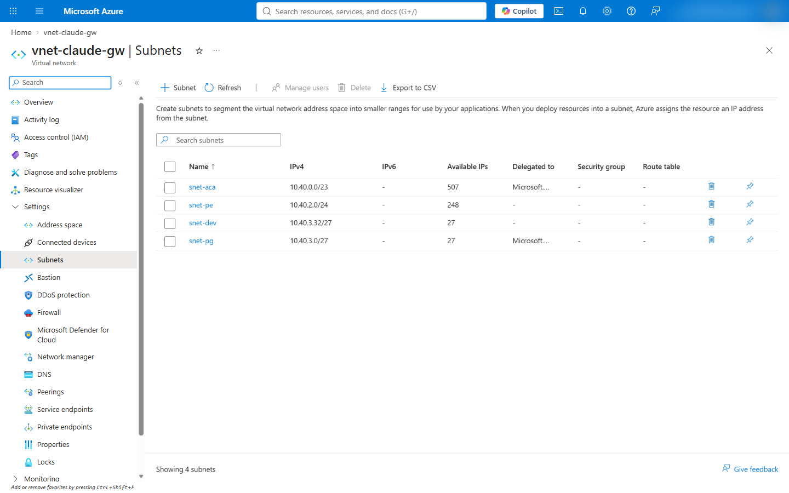

# [Azure CLI](#tab/cli)

```powershell
az group create --name $rg --location $location
az network vnet create -g $rg -n $vnet --location $location --address-prefixes 10.40.0.0/16
az network public-ip create -g $rg -n pip-ng-dev --location $location --sku Standard
az network nat gateway create -g $rg -n ng-dev --location $location --public-ip-addresses pip-ng-dev
az network vnet subnet create -g $rg --vnet-name $vnet -n snet-aca --address-prefixes 10.40.0.0/23 --delegations Microsoft.App/environments
az network vnet subnet create -g $rg --vnet-name $vnet -n snet-pe --address-prefixes 10.40.2.0/24
az network vnet subnet create -g $rg --vnet-name $vnet -n snet-pg --address-prefixes 10.40.3.0/27 --delegations Microsoft.DBforPostgreSQL/flexibleServers
az network vnet subnet create -g $rg --vnet-name $vnet -n snet-dev --address-prefixes 10.40.3.32/27 --nat-gateway ng-dev
```

# [Script](#tab/script)

```powershell
pwsh -File infra/azure-private/Deploy-Gateway.ps1 -Step network
```

The step is in infra/azure-private/lib/Steps.Base.psm1:6-27.

---

### Step 2: Create the private DNS zones for Foundry

A Foundry account answers on three host names, `<account>.cognitiveservices.azure.com`, `<account>.openai.azure.com`
and `<account>.services.ai.azure.com`, and each family has its own private DNS zone
([private endpoint DNS](https://learn.microsoft.com/en-us/azure/private-link/private-endpoint-dns)). Each zone is
linked to the virtual network, so the names resolve to the private endpoint inside it.

# [Azure portal](#tab/portal)

1. **Private DNS zones** > **Create**: name `privatelink.cognitiveservices.azure.com`, resource group `rg-claude-gw-internal`.
1. The zone > **DNS Management** > **Virtual Network Links** > **Add**: name `link-vnet-claude-gw`, virtual network
   `vnet-claude-gw`, auto registration off
   ([private DNS quickstart](https://learn.microsoft.com/en-us/azure/dns/private-dns-getstarted-portal)).
1. Repeat for `privatelink.openai.azure.com` and `privatelink.services.ai.azure.com`.

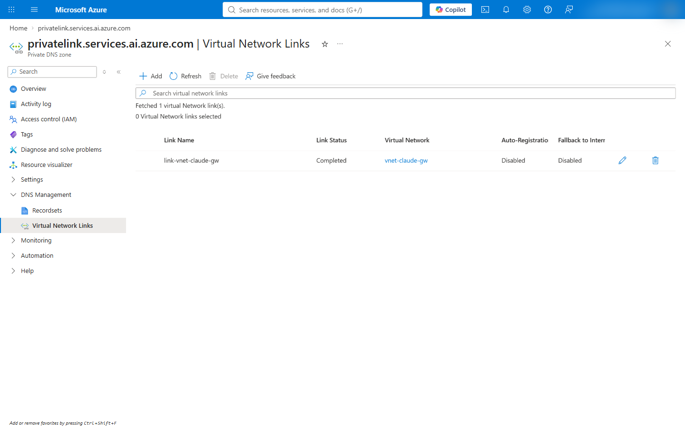

# [Azure CLI](#tab/cli)

```powershell
foreach ($zone in 'privatelink.cognitiveservices.azure.com', 'privatelink.openai.azure.com', 'privatelink.services.ai.azure.com') {
    az network private-dns zone create -g $rg -n $zone
    az network private-dns link vnet create -g $rg -z $zone -n "link-$vnet" -v $vnet -e false
}
```

# [Script](#tab/script)

```powershell
pwsh -File infra/azure-private/Deploy-Gateway.ps1 -Step dns
```

The step is in infra/azure-private/lib/Steps.Base.psm1:30-43.

---

### Step 3: Create the Foundry account, the Claude deployments and the private endpoint

The account's public network access is disabled, so only the private endpoint reaches it, and local (key)
authentication is disabled, so only Entra ID tokens are accepted
([disable local authentication](https://learn.microsoft.com/en-us/azure/ai-services/disable-local-auth)). Each Claude
deployment carries a `modelProviderData` block with the organization's name, country code and industry, which accepts
the Azure Marketplace offer for Claude
([terms of use](https://learn.microsoft.com/en-us/azure/developer/ai/how-to/deploy-claude-foundry#terms-of-use)). The
Azure CLI's `az cognitiveservices account deployment create` has no option for that block, so the CLI tab writes the
deployment through Azure Resource Manager with `az rest` (infra/azure-private/lib/Steps.Base.psm1:57-67).

# [Azure portal](#tab/portal)

1. **Foundry** (Azure AI Foundry) > **Create** a resource: name `ai-claude-gw-<suffix>`, region **East US 2**.
1. **Foundry portal** (ai.azure.com), the resource > **Models + endpoints** > **Deploy model**: `claude-sonnet-5`,
   deployment type **Global Standard**; `claude-opus-5`, **Data Zone Standard**. The deployment dialog asks for the
   organization name, country and industry
   ([deploy Foundry models](https://learn.microsoft.com/en-us/azure/foundry/foundry-models/how-to/deploy-foundry-models)).
1. The resource > **Resource Management** > **Networking** > **Private endpoint connections** > **+ Private endpoint**:
   name `pe-foundry`, region **North Central US**, target sub-resource `account`, virtual network `vnet-claude-gw` /
   `snet-pe`, private DNS integration with the three zones of step 2
   ([configure private link](https://learn.microsoft.com/en-us/azure/foundry/how-to/configure-private-link#add-a-private-endpoint-to-an-existing-resource)).
1. **Networking** > **Firewalls and virtual networks** > **Allow access from**: **Disabled** > **Save**.
1. Key authentication: the [disable local authentication](https://learn.microsoft.com/en-us/azure/ai-services/disable-local-auth#how-to-disable-local-authentication)
   guide sets `disableLocalAuth` with a template, PowerShell or Azure Policy; the CLI tab's `az resource update` sets it.

With public network access disabled, the Foundry portal manages the account only from a network with a path to its
private endpoint ([configure private link](https://learn.microsoft.com/en-us/azure/foundry/how-to/configure-private-link#choose-a-secure-connection-method-to-foundry));
the CLI tab creates the deployments through Azure Resource Manager, which does not need that path. The deployment
recorded here created both deployments after public access was disabled.

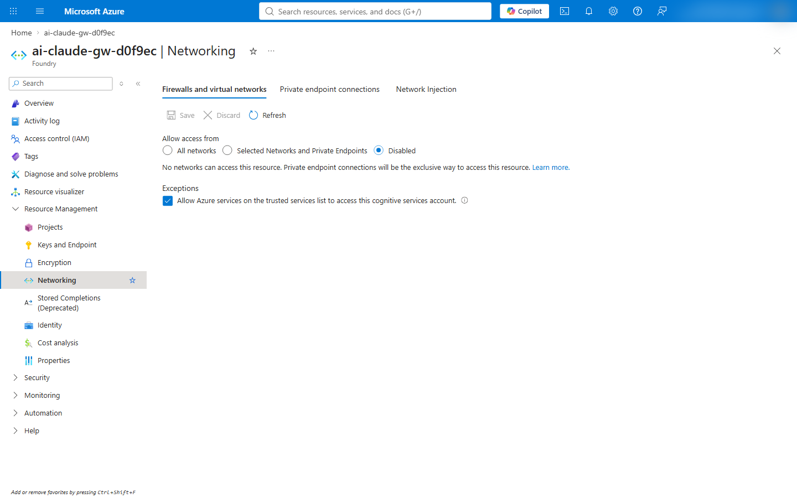

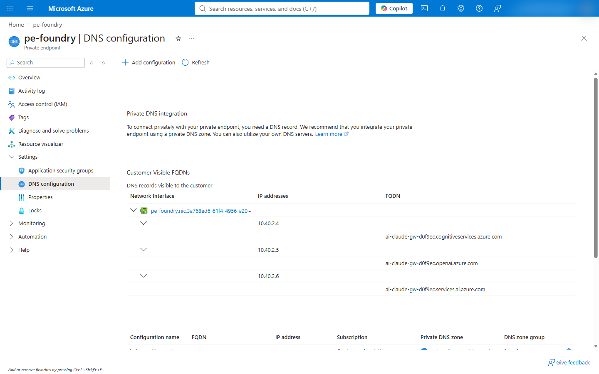

# [Azure CLI](#tab/cli)

```powershell
az cognitiveservices account create -g $rg -n $foundry --location $foundryLocation --kind AIServices --sku S0 --custom-domain $foundry --yes
$foundryId = az cognitiveservices account show -g $rg -n $foundry --query id -o tsv
az resource update --ids $foundryId --set properties.publicNetworkAccess=Disabled properties.disableLocalAuth=true

# One deployment per model; the terms block names your organization.
foreach ($m in @(@{ Name = 'claude-sonnet-5'; Sku = 'GlobalStandard' }, @{ Name = 'claude-opus-5'; Sku = 'DataZoneStandard' })) {
    @{ sku = @{ name = $m.Sku; capacity = 10 }
       properties = @{ model = @{ format = 'Anthropic'; name = $m.Name; version = '2' }
                       modelProviderData = @{ organizationName = 'Contoso Ltd'; countryCode = 'US'; industry = 'technology' } } } |
        ConvertTo-Json -Depth 5 | Set-Content "deployment-$($m.Name).json"
    az rest --method put --url "https://management.azure.com$foundryId/deployments/$($m.Name)?api-version=2025-10-01-preview" --body "@deployment-$($m.Name).json"
}

az network private-endpoint create -g $rg -n pe-foundry --location $location --vnet-name $vnet --subnet snet-pe --private-connection-resource-id $foundryId --group-id account --connection-name foundry
az network private-endpoint dns-zone-group create -g $rg --endpoint-name pe-foundry -n foundry --private-dns-zone privatelink.cognitiveservices.azure.com --zone-name cognitiveservices
az network private-endpoint dns-zone-group add -g $rg --endpoint-name pe-foundry -n foundry --private-dns-zone privatelink.openai.azure.com --zone-name openai
az network private-endpoint dns-zone-group add -g $rg --endpoint-name pe-foundry -n foundry --private-dns-zone privatelink.services.ai.azure.com --zone-name services-ai
```

The capacity is in the quota units of the model and deployment type; the model versions are the ones this deployment
used (infra/azure-private/Deploy-Gateway.ps1:90-94).

# [Script](#tab/script)

```powershell
pwsh -File infra/azure-private/Deploy-Gateway.ps1 -Step foundry -ClaudeOrganizationName 'Contoso Ltd' -ClaudeCountryCode US -ClaudeIndustry technology
```

The step refuses to create a Claude deployment without `-ClaudeOrganizationName`
(infra/azure-private/lib/Steps.Base.psm1:45-83).

---

### Step 4: Create the PostgreSQL server

The gateway keeps device-flow grants and rate-limit counters in PostgreSQL 14 or later
([store](https://code.claude.com/docs/en/claude-apps-gateway-config#store)). The server uses private access: it has
no public endpoint, and its name resolves through a private DNS zone linked to the virtual network
([private access](https://learn.microsoft.com/en-us/azure/postgresql/network/concepts-networking-private)).
Burstable B1ms is a test size with 35 user connections; sizing is in
[Plan capacity for 25,000 developers](concept-plan-for-scale.md).

# [Azure portal](#tab/portal)

1. **Azure Database for PostgreSQL flexible servers** > **Create**: name `psql-claude-gw-<suffix>`, region
   **North Central US**, PostgreSQL version **16**, **Compute + storage**: Burstable, Standard_B1ms, 32 GiB, high
   availability disabled; **Authentication**: PostgreSQL authentication, administrator `gatewayadmin`
   ([create a server](https://learn.microsoft.com/en-us/azure/postgresql/configure-maintain/quickstart-create-server)).
1. **Networking**: **Private access (VNet Integration)**, virtual network `vnet-claude-gw`, subnet `snet-pg`, a new
   private DNS zone `psql-claude-gw-<suffix>.private.postgres.database.azure.com`.
1. After creation: the server > **Settings** > **Databases** > **+ Add**: `gateway`.

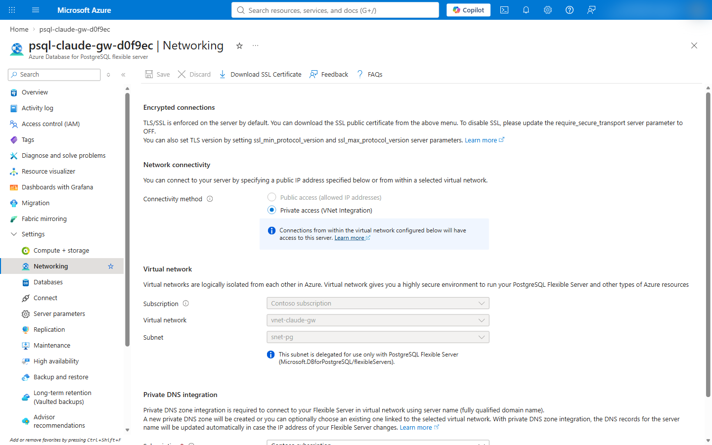

# [Azure CLI](#tab/cli)

```powershell
# A random password in a file; the CLI reads it from the file, and --output none keeps the reply, which repeats the
# password, off the console.
$pgPassword = ([Convert]::ToBase64String([Security.Cryptography.RandomNumberGenerator]::GetBytes(32)) -replace '[+/=]', '') + 'Aa1!'
[IO.File]::WriteAllText("$work\pg-password.txt", $pgPassword)

az postgres flexible-server create -g $rg -n $postgres --location $location --tier Burstable --sku-name Standard_B1ms --version 16 --storage-size 32 --zonal-resiliency Disabled --vnet $vnet --subnet snet-pg --private-dns-zone "$postgres.private.postgres.database.azure.com" --admin-user gatewayadmin --admin-password "@$work\pg-password.txt" --yes --output none
az postgres flexible-server db create -g $rg -s $postgres -d gateway
```

The reply of `az postgres flexible-server create` holds the administrator password and a connection string with it
([the command's source](https://github.com/Azure/azure-cli/blob/dev/src/azure-cli/azure/cli/command_modules/postgresql/commands/custom_commands.py)).
Step 9 reads `pg-password.txt`.

# [Script](#tab/script)

```powershell
pwsh -File infra/azure-private/Deploy-Gateway.ps1 -Step postgres -PostgresSku Standard_B1ms -PostgresTier Burstable
```

The script keeps the password in memory for the app step of the same run. An app step that runs alone reads the password
from the Container App's `pg-password` secret, and sets a new one on the server only when the app does not have that
secret (infra/azure-private/lib/Steps.App.psm1:139-152).

---

### Step 5: Create the registry and build the gateway image

The image runs the Claude Code binary as the gateway. Its build downloads the release, checks the release manifest's
signature and the binary's SHA-256 checksum, and fails on a mismatch (docs/adr/0005-network-restricted-deployment.md:71;
infra/azure-test/image/Dockerfile:14-20). `az acr build` runs the build as an ACR Tasks quick task in Azure
([ACR Tasks quickstart](https://learn.microsoft.com/en-us/azure/container-registry/container-registry-quickstart-task-cli)).
For a registry with a private endpoint and public access disabled, ACR Tasks runs the build on a dedicated agent pool in
the virtual network ([agent pools](https://learn.microsoft.com/en-us/azure/container-registry/tasks-agent-pools#create-pool-in-a-virtual-network)).

# [Azure portal](#tab/portal)

1. **Container registries** > **Create**: name `acrclaudegw<suffix>`, region **North Central US**, pricing plan
   **Basic**; admin user disabled
   ([registry quickstart](https://learn.microsoft.com/en-us/azure/container-registry/container-registry-get-started-portal)).
1. Build the image with the CLI tab's `az acr build`; the registry > **Services** > **Repositories** then lists
   `claude-gateway`.

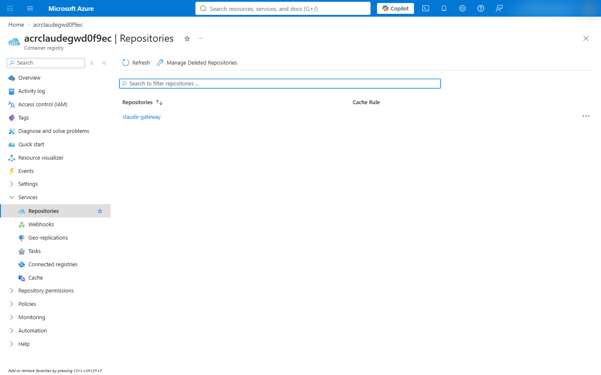

# [Azure CLI](#tab/cli)

```powershell
az acr create -g $rg -n $acr --location $location --sku Basic --admin-enabled false
az acr build --registry $acr --image claude-gateway:2.1.284 --build-arg CLAUDE_VERSION=2.1.284 --build-arg CLAUDE_SHA256=5cd90aabd83f8a15136c35aa37bb1d92b348993573316643dc3fe4e04afbf88f --no-logs infra/azure-test/image
$image = "$acr.azurecr.io/claude-gateway@" + (az acr repository show -n $acr --image claude-gateway:2.1.284 --query digest -o tsv)
```

`--no-logs` makes the CLI wait for the build and print the run as JSON, whose `status` is `Succeeded` for a good
build; without it, the CLI prints the build log (tests/azure-private/fake-az.mjs:15-19). The checksum is the
`linux-x64` value in the release manifest of Claude Code 2.1.284 (infra/azure-private/Deploy-Gateway.ps1:96-97).

# [Script](#tab/script)

```powershell
pwsh -File infra/azure-private/Deploy-Gateway.ps1 -Step registry
```

The step stops when the build's status is not `Succeeded` (infra/azure-private/lib/Steps.Base.psm1:106-125).

---

### Step 6: Create the gateway's identity

The gateway pulls its image and calls Foundry with a user-assigned managed identity. `AcrPull` lets it pull from the
registry ([image pull with managed identity](https://learn.microsoft.com/en-us/azure/container-apps/managed-identity-image-pull)),
and `Cognitive Services User` lets it call the Foundry account; the gateway's Foundry upstream authenticates through
`DefaultAzureCredential` ([Microsoft Foundry upstream](https://code.claude.com/docs/en/claude-apps-gateway-config#microsoft-foundry)).

# [Azure portal](#tab/portal)

1. **Managed Identities** > **Create**: name `id-claude-gw`, region **North Central US**
   ([user-assigned identities](https://learn.microsoft.com/en-us/entra/identity/managed-identities-azure-resources/manage-user-assigned-managed-identities-azure-portal)).
1. The registry > **Access control (IAM)** > **Add role assignment**: role **AcrPull**, assign access to
   **Managed identity**, member `id-claude-gw`
   ([assign roles in the portal](https://learn.microsoft.com/en-us/azure/role-based-access-control/role-assignments-portal)).
1. The Foundry account > **Access control (IAM)** > **Add role assignment**: role **Cognitive Services User**, member
   `id-claude-gw`.

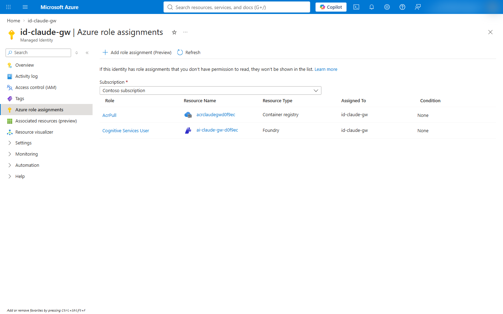

# [Azure CLI](#tab/cli)

```powershell
az identity create -g $rg -n $identity --location $location
$principalId = az identity show -g $rg -n $identity --query principalId -o tsv
$identityClientId = az identity show -g $rg -n $identity --query clientId -o tsv
$identityId = az identity show -g $rg -n $identity --query id -o tsv
$acrId = az acr show -g $rg -n $acr --query id -o tsv
az role assignment create --assignee-object-id $principalId --assignee-principal-type ServicePrincipal --role AcrPull --scope $acrId
az role assignment create --assignee-object-id $principalId --assignee-principal-type ServicePrincipal --role "Cognitive Services User" --scope $foundryId
```

# [Script](#tab/script)

```powershell
pwsh -File infra/azure-private/Deploy-Gateway.ps1 -Step identity
```

The step is in infra/azure-private/lib/Steps.Base.psm1:127-145.

---

### Step 7: Create the internal Container Apps environment

An internal environment has no public endpoint: its apps are reachable from the virtual network at the environment's
static IP ([custom virtual network](https://learn.microsoft.com/en-us/azure/container-apps/vnet-custom)). A private
DNS zone named after the environment's default domain, with a `*` record for the static IP, resolves the app's host
name inside the network
([private DNS zone for an environment](https://learn.microsoft.com/en-us/azure/container-apps/waf-app-gateway#create-and-configure-an-azure-private-dns-zone)).

# [Azure portal](#tab/portal)

1. **Log Analytics workspaces** > **Create**: name `log-claude-gw`, region **North Central US**.
1. **Container Apps Environments** > **Create**: name `cae-claude-gw`, region **North Central US**, environment type
   **Workload profiles**; **Monitoring**: Log Analytics `log-claude-gw`; **Networking**: use your own virtual network
   **Yes**, `vnet-claude-gw`, infrastructure subnet `snet-aca`, **Virtual IP**: **Internal**.
1. The environment > **Overview**: note the **Static IP**; the **Default domain** is in **JSON View** as
   `properties.defaultDomain`.
1. **Private DNS zones** > **Create**: the default domain as the zone name. The zone > **DNS Management** >
   **Recordsets** > **+ Add**: name `*`, type A, the static IP. **Virtual Network Links** > **Add**: `vnet-claude-gw`.

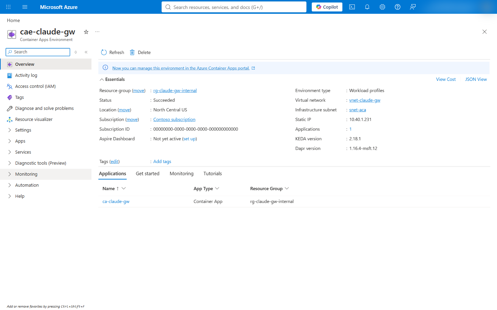

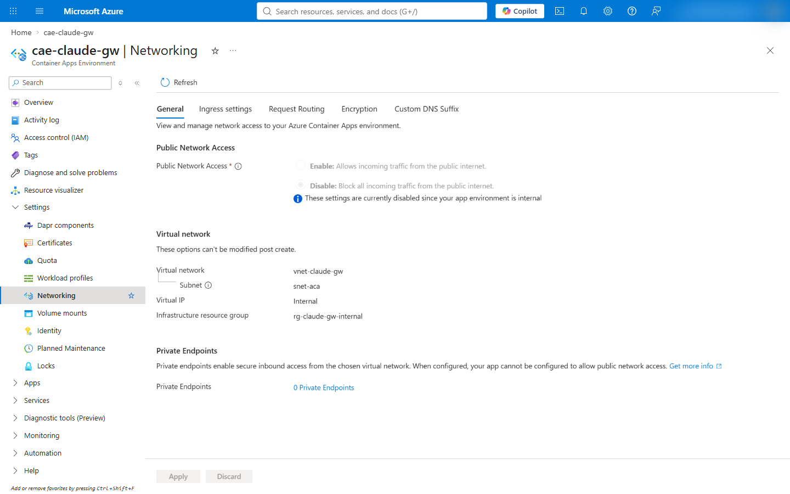

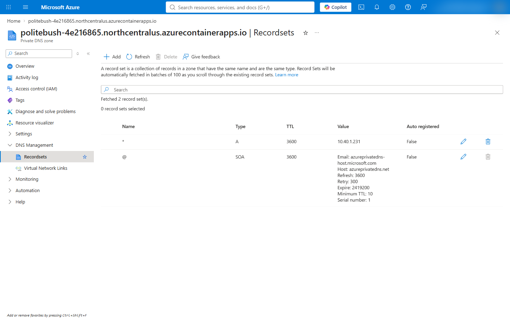

# [Azure CLI](#tab/cli)

```powershell
az monitor log-analytics workspace create -g $rg -n log-claude-gw --location $location --retention-time 30
$workspaceId = az monitor log-analytics workspace show -g $rg -n log-claude-gw --query customerId -o tsv
$workspaceKey = az monitor log-analytics workspace get-shared-keys -g $rg -n log-claude-gw --query primarySharedKey -o tsv
[IO.File]::WriteAllText("$work\workspace-key.txt", $workspaceKey)
$acaSubnetId = az network vnet subnet show -g $rg --vnet-name $vnet -n snet-aca --query id -o tsv
az containerapp env create -g $rg -n $environment --location $location --enable-workload-profiles true --infrastructure-subnet-resource-id $acaSubnetId --internal-only true --logs-destination log-analytics --logs-workspace-id $workspaceId --logs-workspace-key "@$work\workspace-key.txt"

$domain = az containerapp env show -g $rg -n $environment --query properties.defaultDomain -o tsv
$staticIp = az containerapp env show -g $rg -n $environment --query properties.staticIp -o tsv
az network private-dns zone create -g $rg -n $domain
az network private-dns link vnet create -g $rg -z $domain -n "link-$vnet" -v $vnet -e false
az network private-dns record-set a add-record -g $rg -z $domain -n "*" -a $staticIp
```

The environment in this tutorial got the default domain `politebush-4e216865.northcentralus.azurecontainerapps.io`
and the static IP 10.40.1.231.

# [Script](#tab/script)

```powershell
pwsh -File infra/azure-private/Deploy-Gateway.ps1 -Step environment
```

The step is in infra/azure-private/lib/Steps.App.psm1:5-38.

---

### Step 8: Register the gateway in Microsoft Entra ID

The gateway is a confidential OpenID Connect client. Its redirect URI is `<public URL>/oauth/callback`, Entra ID
issues v2.0 tokens, and the gateway admits a user whose token carries one of its app roles in the `roles` claim
([identity provider setup](https://code.claude.com/docs/en/claude-apps-gateway-deploy#identity-provider-setup);
config/gateway.azure-private.yaml:22-23). The app roles, the `email` optional claim and the delegated permissions
`openid`, `profile`, `email` and `offline_access` come from `infra/azure-test/entra-app.json`.

# [Azure portal](#tab/portal)

1. **Microsoft Entra ID** > **App registrations** > **New registration**: name `claude-apps-gateway-private-<suffix>`,
   single tenant, redirect URI **Web** `https://ca-claude-gw.<default domain>/oauth/callback`
   ([register an application](https://learn.microsoft.com/en-us/entra/identity-platform/quickstart-register-app)).
1. The app > **App roles** > **Create app role**: `Gateway.Standard` and `Gateway.Premium`, allowed member types
   **Users/Groups** ([app roles](https://learn.microsoft.com/en-us/entra/identity-platform/howto-add-app-roles-in-apps)).
1. **Token configuration** > **Add optional claim**: ID token, `email`.
1. **Manifest**: `api.requestedAccessTokenVersion` = `2`
   ([app manifest](https://learn.microsoft.com/en-us/entra/identity-platform/reference-microsoft-graph-app-manifest)).
1. **Certificates & secrets** > **New client secret**: **Expires** set to a custom 7 days, or the period the
   organization's credential policy sets; the gateway reads the secret as `OIDC_CLIENT_SECRET` in step 9
   ([add a client secret](https://learn.microsoft.com/en-us/entra/identity-platform/how-to-add-credentials)).
1. **Enterprise applications** > the app > **Users and groups** > **Add user/group**: a user or group, with a role
   ([assign users and groups](https://learn.microsoft.com/en-us/entra/identity/enterprise-apps/assign-user-or-group-access-portal)).

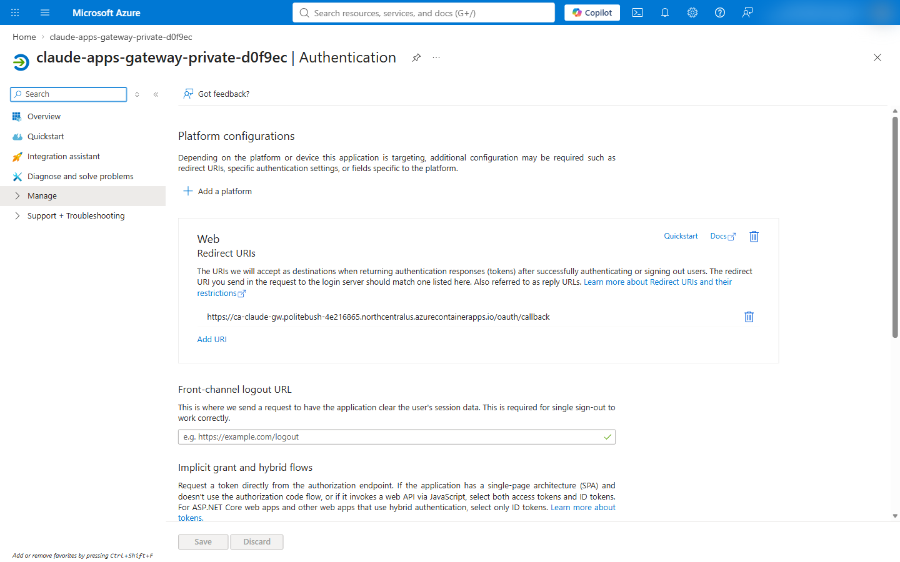

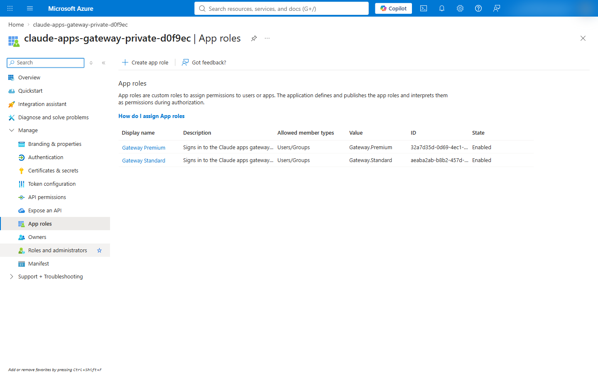

# [Azure CLI](#tab/cli)

```powershell
$manifest = Get-Content infra/azure-test/entra-app.json -Raw | ConvertFrom-Json
ConvertTo-Json -Depth 10 -InputObject $manifest.appRoles | Set-Content "$work\app-roles.json"
ConvertTo-Json -Depth 10 -InputObject $manifest.optionalClaims | Set-Content "$work\optional-claims.json"
ConvertTo-Json -Depth 10 -InputObject $manifest.requiredResourceAccess | Set-Content "$work\graph-access.json"

$appId = az ad app create --display-name "claude-apps-gateway-private-$suffix" --sign-in-audience AzureADMyOrg --web-redirect-uris "https://$app.$domain/oauth/callback" --app-roles "@$work\app-roles.json" --optional-claims "@$work\optional-claims.json" --required-resource-accesses "@$work\graph-access.json" --query appId -o tsv
az ad app update --id $appId --set api.requestedAccessTokenVersion=2
$spId = az ad sp create --id $appId --query id -o tsv

# Give yourself Gateway.Premium; other users and groups get a role the same way, or in the portal.
$premium = ($manifest.appRoles | Where-Object value -eq 'Gateway.Premium').id
$me = az ad signed-in-user show --query id -o tsv
@{ principalId = $me; resourceId = $spId; appRoleId = $premium } | ConvertTo-Json | Set-Content "$work\role-assignment.json"
az rest --method POST --url "https://graph.microsoft.com/v1.0/servicePrincipals/$spId/appRoleAssignedTo" --body "@$work\role-assignment.json" --headers Content-Type=application/json
```

A new service principal can take a few seconds to reach Microsoft Graph; the script retries the role assignment
(infra/azure-private/lib/Steps.App.psm1:87-91).

# [Script](#tab/script)

```powershell
pwsh -File infra/azure-private/Deploy-Gateway.ps1 -Step entra -OperatorRole Gateway.Premium
```

The script creates the client secret in the app step, valid for `-ClientSecretDays` days (default 7). With
`-RotateClientSecret` it adds a new secret and restarts the latest revision, because a changed secret reaches a
revision only when the revision restarts or a new one is deployed
([manage secrets](https://learn.microsoft.com/en-us/azure/container-apps/manage-secrets);
infra/azure-private/lib/Steps.App.psm1:153-158; infra/azure-private/lib/Steps.App.psm1:172-175). The old secret stays valid until it expires, since `--append` keeps it.

---

### Step 9: Configure and deploy the gateway

The gateway reads `gateway.yaml`, rendered from the admin file `config/gateway-admin.azure-private.json`: the app
roles it admits, the models and their Foundry deployments, a policy per role with its `availableModels`, the networks
developers connect from, and the sign-in limits (scripts/admin/new-gateway-config.mjs:196-236). Values specific to the
deployment and every secret are `${VAR}` references that the Container App sets as environment variables
([secret expansion](https://code.claude.com/docs/en/claude-apps-gateway-config#secret-expansion)).

The configuration's network settings for this topology:

```yaml
listen:
  public_url: "${GATEWAY_PUBLIC_URL}"
  trusted_proxies: [100.100.0.0/17, 100.100.128.0/19, 100.100.160.0/19, 100.100.192.0/19]   # where the ingress connects from
store:
  max_connections: 5
  readiness_grace_seconds: 300                    # keeps /readyz ready through a database failover
upstreams:
  - provider: foundry
    resource: "${FOUNDRY_RESOURCE}"
    auth: { use_azure_ad: true }
access_control:
  allow_cidrs: [10.40.0.0/16]                     # deployment.developerCidrs in the admin file
```

The full file is config/gateway.azure-private.yaml:8-73. `trusted_proxies` names the ranges a workload profile
environment reserves, where the Container Apps ingress connects from; the ingress puts the client's address rightmost
in `X-Forwarded-For`, so the gateway sees each developer's own address, and a developer cannot set `X-Forwarded-For`
to take another address's sign-in limit (docs/adr/0005-network-restricted-deployment.md:75-88). The gateway container's
secrets and settings:

| Setting | Value | Portal location |
|---|---|---|
| Image | `acrclaudegw<suffix>.azurecr.io/claude-gateway@<digest>`, pulled with `id-claude-gw` | **Containers** > **Edit and deploy** |
| Command and arguments | `/usr/local/bin/claude` with `gateway --config /etc/claude/gateway.yaml` | **Containers** > the container |
| CPU and memory | 1 vCPU, 2 GiB | **Containers** > the container |
| Secrets | `gateway-config` (the rendered YAML), `oidc-client-secret`, `jwt-secret`, `pg-password` | **Security** > **Secrets** |
| Volume | Secret volume `gateway-config` with the file `gateway.yaml`, mounted at `/etc/claude` | **Containers** > **Volumes** |
| Environment variables | Listed in the CLI tab | **Containers** > the container > **Environment variables** |
| Health probes | Startup and liveness on `/healthz`, readiness on `/readyz`, port 8080 | **Containers** > the container > **Health probes** |
| Ingress | Enabled, **Limited to VNet**, HTTP, target port 8080 | **Networking** > **Ingress** |
| Scale | 2 to 3 replicas, HTTP rule of 150 concurrent requests | **App** > **Scale** |
| Identity | User assigned: `id-claude-gw` | **Security** > **Identity** |

The readiness probe on `/readyz` fails when the store is unreachable
([health](https://code.claude.com/docs/en/claude-apps-gateway-deploy#health)).
`CLAUDE_GATEWAY_DRAIN_TIMEOUT_MS` gives open streams two minutes when a replica stops, and the termination grace
period is 10 seconds longer ([upgrades](https://code.claude.com/docs/en/claude-apps-gateway-deploy#upgrades)).
`BUN_CONFIG_MAX_HTTP_REQUESTS` is how many requests a replica sends upstream at once
([concurrent upstream requests](https://code.claude.com/docs/en/claude-apps-gateway-deploy#concurrent-upstream-requests)).

# [Azure portal](#tab/portal)

1. Render the configuration with the CLI tab's `node scripts/admin/new-gateway-config.mjs --topology private`.
1. **Container Apps** > **Create**: name `ca-claude-gw`, environment `cae-claude-gw`; **Container**: the image from
   `acrclaudegw<suffix>` with managed identity `id-claude-gw`, CPU and memory from the table; **Ingress**: enabled,
   **Limited to VNet**, target port 8080 ([portal quickstart](https://learn.microsoft.com/en-us/azure/container-apps/quickstart-portal)).
1. **Security** > **Secrets** > **+ Add**, once for each secret in the table
   ([manage secrets](https://learn.microsoft.com/en-us/azure/container-apps/manage-secrets)).
1. **Containers** > **Edit and deploy**: the command, arguments, environment variables, the secret volume at
   `/etc/claude` ([secret volumes](https://learn.microsoft.com/en-us/azure/container-apps/manage-secrets#secrets-volume-mounts))
   and the probes ([health probes](https://learn.microsoft.com/en-us/azure/container-apps/health-probes)); **Scale**:
   minimum 2, maximum 3, an HTTP rule with 150 concurrent requests
   ([scale rules](https://learn.microsoft.com/en-us/azure/container-apps/scale-app)) > **Create**.

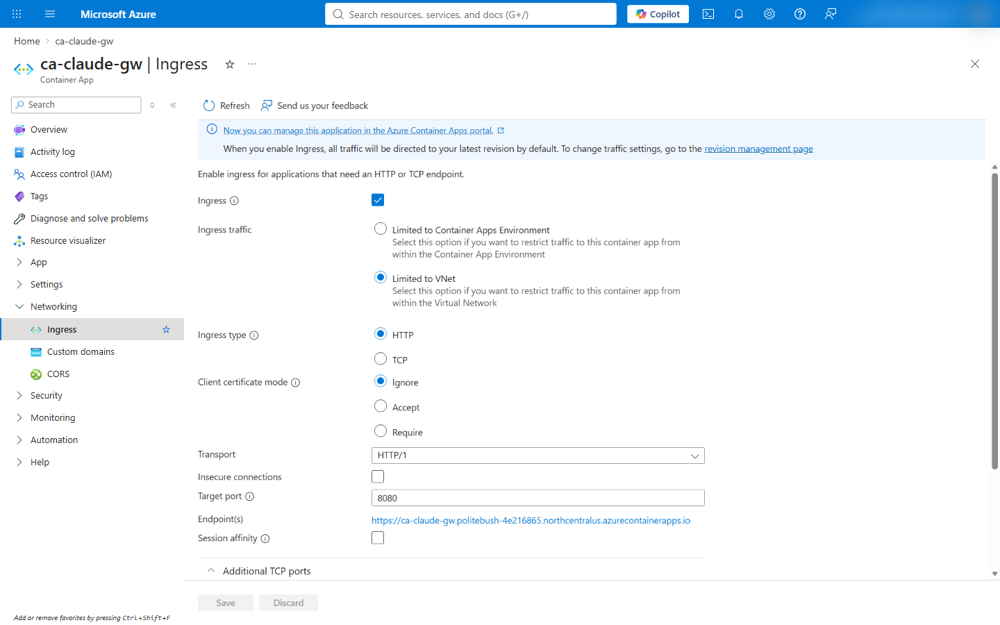

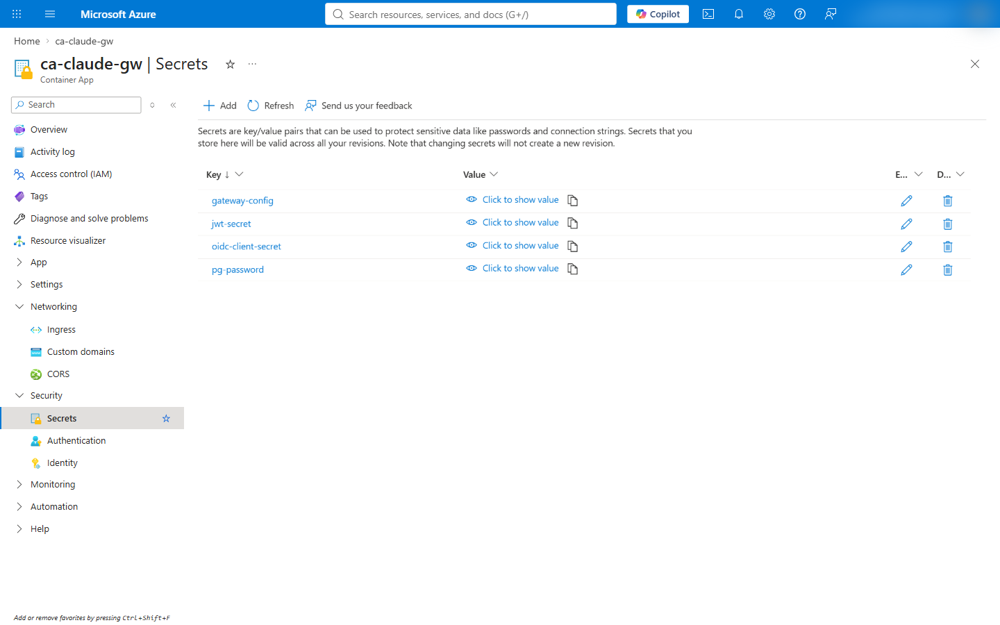

# [Azure CLI](#tab/cli)

Render the configuration, create the client secret, valid for 7 days like the script's default, and the
session-signing secret, then write the app definition. The organization's credential policy sets the client secret's
lifetime ([add a client secret](https://learn.microsoft.com/en-us/entra/identity-platform/how-to-add-credentials)):

```powershell
node scripts/admin/new-gateway-config.mjs --topology private
$end = [DateTime]::UtcNow.AddDays(7).ToString('yyyy-MM-ddTHH:mm:ssZ')
$oidcSecret = az ad app credential reset --id $appId --append --display-name gateway --end-date $end --query password -o tsv
$jwtSecret = [Convert]::ToBase64String([Security.Cryptography.RandomNumberGenerator]::GetBytes(48))
$environmentId = az containerapp env show -g $rg -n $environment --query id -o tsv
$config = (Get-Content config/gateway.azure-private.yaml | ForEach-Object { "          $_" }) -join "`n"

$definition = @"
location: $location
identity:
  type: UserAssigned
  userAssignedIdentities:
    "$identityId": {}
properties:
  environmentId: "$environmentId"
  workloadProfileName: Consumption
  configuration:
    activeRevisionsMode: Single
    ingress: { external: true, targetPort: 8080, transport: http, allowInsecure: false }
    registries:
      - { server: "$acr.azurecr.io", identity: "$identityId" }
    secrets:
      - name: gateway-config
        value: |
$config
      - { name: oidc-client-secret, value: "$oidcSecret" }
      - { name: jwt-secret, value: "$jwtSecret" }
      - { name: pg-password, value: "$pgPassword" }
  template:
    terminationGracePeriodSeconds: 130
    containers:
      - name: gateway
        image: "$image"
        command: [/usr/local/bin/claude]
        args: [gateway, --config, /etc/claude/gateway.yaml]
        resources: { cpu: 1.0, memory: 2Gi }
        env:
          - { name: CLAUDE_GATEWAY_LOG_LEVEL, value: info }
          - { name: AZURE_CLIENT_ID, value: "$identityClientId" }
          - { name: GATEWAY_PUBLIC_URL, value: "https://$app.$domain" }
          - { name: OIDC_ISSUER, value: "https://login.microsoftonline.com/$tenantId/v2.0" }
          - { name: OIDC_CLIENT_ID, value: "$appId" }
          - { name: ALLOWED_EMAIL_DOMAIN, value: "$allowedDomain" }
          - { name: GATEWAY_PG_USER, value: gatewayadmin }
          - { name: GATEWAY_PG_HOST, value: "$postgres.postgres.database.azure.com" }
          - { name: FOUNDRY_RESOURCE, value: "$foundry" }
          - { name: BUN_CONFIG_MAX_HTTP_REQUESTS, value: "256" }
          - { name: CLAUDE_GATEWAY_DRAIN_TIMEOUT_MS, value: "120000" }
          - { name: OIDC_CLIENT_SECRET, secretRef: oidc-client-secret }
          - { name: GATEWAY_JWT_SECRET, secretRef: jwt-secret }
          - { name: GATEWAY_PG_PASSWORD, secretRef: pg-password }
        probes:
          - { type: Startup, httpGet: { path: /healthz, port: 8080 }, initialDelaySeconds: 5, periodSeconds: 10, timeoutSeconds: 3, failureThreshold: 30 }
          - { type: Liveness, httpGet: { path: /healthz, port: 8080 }, periodSeconds: 15, timeoutSeconds: 3, failureThreshold: 3 }
          - { type: Readiness, httpGet: { path: /readyz, port: 8080 }, periodSeconds: 10, timeoutSeconds: 3, failureThreshold: 3 }
        volumeMounts:
          - { volumeName: gateway-config, mountPath: /etc/claude }
    volumes:
      - { name: gateway-config, storageType: Secret, secrets: [{ secretRef: gateway-config, path: gateway.yaml }] }
    scale:
      minReplicas: 2
      maxReplicas: 3
      rules:
        - { name: http-concurrency, http: { metadata: { concurrentRequests: "150" } } }
"@
[IO.File]::WriteAllText("$work\containerapp.yaml", $definition)

az containerapp create -g $rg -n $app --yaml "$work\containerapp.yaml" --output none
az containerapp show -g $rg -n $app --query "{latest:properties.latestRevisionName, ready:properties.latestReadyRevisionName, fqdn:properties.configuration.ingress.fqdn}"
```

The variables `$identityId`, `$identityClientId`, `$image`, `$domain`, `$pgPassword` and `$appId` come from steps 4
to 8, in the same PowerShell session; `$work\pg-password.txt` holds the PostgreSQL password for a new session. The
gateway admits a user who holds an app role and whose email claim ends with `$allowedDomain`
(config/gateway.azure-private.yaml:20-23). The app is ready when `latest` and `ready` name the same revision. The
definition's schema is the Container Apps ARM specification
([ARM and YAML specification](https://learn.microsoft.com/en-us/azure/container-apps/azure-resource-manager-api-spec)),
and the script builds the same definition (infra/azure-private/lib/AppDefinition.psm1:6-85).

# [Script](#tab/script)

```powershell
pwsh -File infra/azure-private/Deploy-Gateway.ps1 -Step app -MinReplicas 2 -MaxReplicas 3 -ConcurrentRequests 150
```

The step checks that config/gateway.azure-private.yaml is the rendering of its admin file, creates the secrets, writes
the definition to a temporary folder, deploys it and waits for the revision to be ready
(infra/azure-private/lib/Steps.App.psm1:120-178).

---

### Step 10: Create a test machine in the network (optional)

A Windows 11 VM in `snet-dev` stands in for a developer machine on the corporate network. It has no public IP and is
reached through Azure Bastion Developer, which needs no public IP or `AzureBastionSubnet` and connects to one VM at a
time ([Bastion SKUs](https://learn.microsoft.com/en-us/azure/bastion/bastion-sku-comparison)). Run Command installs
Claude Code, checked against the release checksum, and VS Code, and writes the machine policies that point Claude Code
and Claude Desktop at the gateway ([Run Command](https://learn.microsoft.com/en-us/azure/virtual-machines/windows/run-command);
infra/azure-private/lib/Steps.Dev.psm1:9-33).

# [Azure portal](#tab/portal)

1. **Virtual machines** > **Create**: name `vm-dev`, region **North Central US**, image **Windows 11 Enterprise**,
   size Standard_D4s_v5; **Networking**: `vnet-claude-gw` / `snet-dev`, public IP **None**, NIC network security
   group **None**.
1. The VM > **Connect** > **Bastion**: with the Developer SKU, Bastion deploys on first connect
   ([Bastion Developer](https://learn.microsoft.com/en-us/azure/bastion/quickstart-host-portal)).
1. The VM > **Operations** > **Run command** > **RunPowerShellScript**: the setup script of the CLI tab.

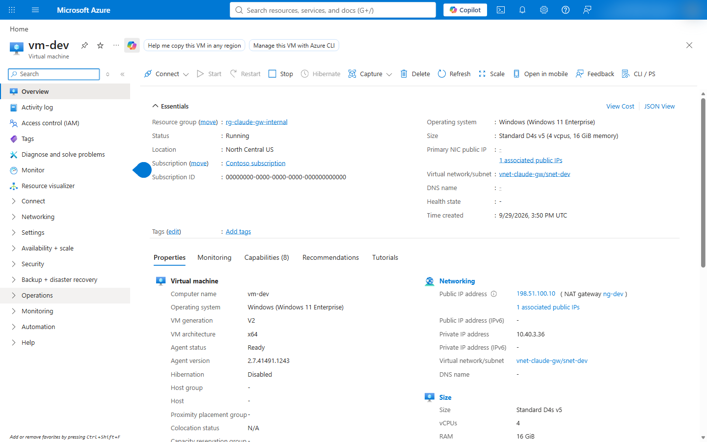

The NAT gateway's public address in this screenshot is replaced with 198.51.100.10, a documentation address
([RFC 5737](https://www.rfc-editor.org/rfc/rfc5737)).

# [Azure CLI](#tab/cli)

The machine policies point Claude Code and Claude Desktop at this deployment's gateway; the file below holds them,
with the host name from step 7. [Connect Claude Code, VS Code and Claude Desktop](how-to-connect-clients.md)
describes both values:

```powershell
$gatewayUrl = "https://$app.$domain"
$policy = @{ forceLoginMethod = 'gateway'; forceLoginGatewayUrl = $gatewayUrl; parentSettingsBehavior = 'merge' } | ConvertTo-Json -Compress
[IO.File]::WriteAllText("$work\vm-setup.txt", @"
New-Item -Path 'HKLM:\SOFTWARE\Policies\ClaudeCode' -Force | Out-Null
New-ItemProperty -Path 'HKLM:\SOFTWARE\Policies\ClaudeCode' -Name Settings -PropertyType String -Force -Value '$policy' | Out-Null
New-Item -Path 'HKLM:\SOFTWARE\Policies\Claude' -Force | Out-Null
New-ItemProperty -Path 'HKLM:\SOFTWARE\Policies\Claude' -Name bootstrapUrl -PropertyType String -Force -Value '$gatewayUrl/user/bootstrap' | Out-Null
"@)

# The VM's administrator password, for signing in through Bastion; keep it in the organization's credential store.
$vmPassword = ([Convert]::ToBase64String([Security.Cryptography.RandomNumberGenerator]::GetBytes(18)) -replace '[+/=]', '') + 'Aa1!'
[IO.File]::WriteAllText("$work\vm-password.txt", $vmPassword)
```

Create the VM and Bastion, then run the setup on the VM:

```powershell
az vm create -g $rg -n vm-dev --location $location --image MicrosoftWindowsDesktop:windows-11:win11-25h2-ent:latest --size Standard_D4s_v5 --license-type Windows_Client --security-type TrustedLaunch --vnet-name $vnet --subnet snet-dev --public-ip-address '""' --nsg '""' --admin-username devadmin --admin-password "@$work\vm-password.txt" --output none
az network bastion create -g $rg -n bas-claude-gw --location $location --sku Developer --vnet-name $vnet
az vm run-command invoke -g $rg -n vm-dev --command-id RunPowerShellScript --scripts "@$work\vm-setup.txt"
```

In PowerShell, `'""'` passes an empty value to the Azure CLI, and `"@file"` is quoted because `@` is special in
PowerShell ([empty strings](https://learn.microsoft.com/en-us/cli/azure/use-azure-cli-successfully-quoting#empty-strings)).
Run Command runs the file's lines as a PowerShell script on the VM
([Run Command](https://learn.microsoft.com/en-us/azure/virtual-machines/windows/run-command)). The script's setup also
installs Claude Code, checked against the release checksum, and VS Code (infra/azure-private/lib/Steps.Dev.psm1:12-29);
on a machine set up by hand, Claude Code installs with Anthropic's installer
([set up Claude Code](https://code.claude.com/docs/en/setup)).

# [Script](#tab/script)

```powershell
pwsh -File infra/azure-private/Deploy-Gateway.ps1 -Step devvm
pwsh -File infra/azure-private/Deploy-Gateway.ps1 -ShowDevVmPassword
```

The script saves the VM password for the current Windows user with DPAPI; `-ShowDevVmPassword` prints the user name
and the password (infra/azure-private/lib/Steps.Dev.psm1:38-50).

---

### Step 11: Verify the deployment

From inside the network, every host name resolves to a private address and the gateway reports ready; from outside,
Foundry refuses a request. The verify step runs these checks on the test machine with Run Command and on the
operator's machine (infra/azure-private/lib/Steps.Dev.psm1:80-129).

# [Azure portal](#tab/portal)

1. The test machine > **Connect** > **Bastion**, then in PowerShell on the VM:
   `Resolve-DnsName ca-claude-gw.<default domain>` and `Invoke-WebRequest https://ca-claude-gw.<default domain>/readyz`.
1. **Container Apps** > `ca-claude-gw` > **Overview**: status **Running** and the application URL on the default domain.

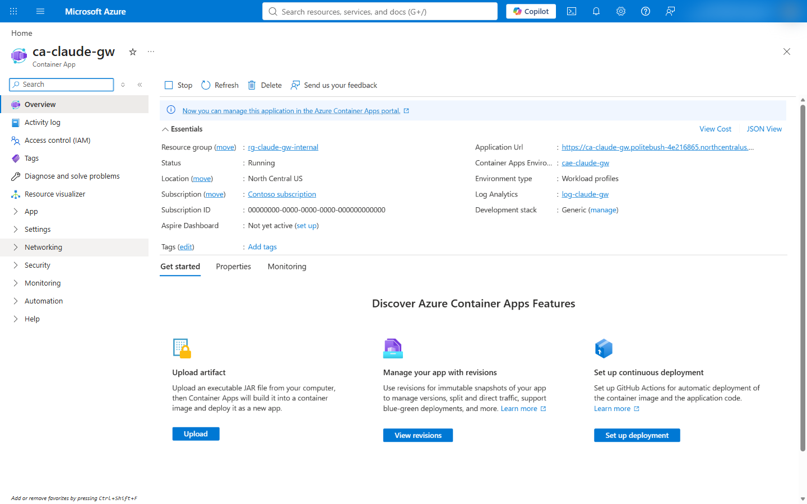

# [Azure CLI](#tab/cli)

The checks run on the test machine with Run Command, for this deployment's host name; the last command reads
PostgreSQL's public access setting:

```powershell
[IO.File]::WriteAllText("$work\vm-check.txt", @"
Resolve-DnsName $app.$domain -Type A
(Invoke-WebRequest -UseBasicParsing https://$app.$domain/readyz).StatusCode
"@)
az vm run-command invoke -g $rg -n vm-dev --command-id RunPowerShellScript --scripts "@$work\vm-check.txt"
az postgres flexible-server show -g $rg -n $postgres --query network.publicNetworkAccess -o tsv
```

# [Script](#tab/script)

```powershell
pwsh -File infra/azure-private/Deploy-Gateway.ps1 -Step verify
```

```output
  PASS  gateway host resolves to private addresses only (T-16)
  PASS  gateway /readyz answers 200 inside the VNet (T-16)
  PASS  PostgreSQL resolves to a private address (T-69)
  PASS  Foundry resolves to the private endpoint (T-68)
  PASS  Foundry refuses a request from outside the VNet: 403 (T-68)
  PASS  PostgreSQL public network access is Disabled (T-69)
  addresses: gateway 10.40.1.231 postgres 10.40.3.4 foundry 10.40.2.6
```

---

## Connect developers

Claude Code, the VS Code extension and Claude Desktop read the gateway's address from machine policy, which Intune or
Group Policy delivers; a developer cannot configure the gateway sign-in in their own settings
([set the gateway URL](https://code.claude.com/docs/en/claude-apps-gateway#set-the-gateway-url)). The client setup,
the sign-in, and the network each developer machine needs are in
[Connect Claude Code, VS Code and Claude Desktop](how-to-connect-clients.md).

At the first sign-in, Claude Code shows the first 16 hexadecimal characters of the SHA-256 fingerprint of the
gateway's certificate, and pins the certificate for the host name
([connect developers](https://code.claude.com/docs/en/claude-apps-gateway#connect-developers)). The fingerprint the
verify step printed for this deployment starts with `2fbc49857fa6e209`.

## Run the whole deployment with the script

The script runs every step in order, creating what is missing (infra/azure-private/Deploy-Gateway.ps1:125-141):

```powershell
# Print the commands without changing anything.
pwsh -File infra/azure-private/Deploy-Gateway.ps1 -Plan -ClaudeOrganizationName 'Contoso Ltd'
# Deploy.
pwsh -File infra/azure-private/Deploy-Gateway.ps1 -ClaudeOrganizationName 'Contoso Ltd'
# Deploy chosen steps; later steps read the names earlier steps created.
pwsh -File infra/azure-private/Deploy-Gateway.ps1 -Step app,verify
```

Every parameter is in the [script reference](reference-scripts.md#deploy-gatewayps1). A re-run reuses existing
resources and reports each with `FOUND`. It can also reconcile settings that drifted: Foundry's public access and key
authentication, the DNS records, the role assignments, the Entra app's redirect URI and role assignment. It creates
a secret the Container App does not have, such as a new PostgreSQL password, and stops before any change when
reading a secret fails for another reason, such as a service that is unavailable; it runs the test machine's setup
again, and updates the Container App with PATCH semantics (infra/azure-private/lib/Steps.Base.psm1:52-53;
infra/azure-private/lib/Steps.App.psm1:57-61; infra/azure-private/lib/Steps.App.psm1:136-161;
infra/azure-private/lib/Az.psm1:112-123; infra/azure-private/lib/Steps.Dev.psm1:73-74). `-Plan` lists what a re-run would change.

## Results of the test deployment

Measured on 2026-09-29 with `pwsh -File infra/azure-private/Deploy-Gateway.ps1`, gateway image Claude Code 2.1.284.
Verified: network isolation, name resolution, readiness, certificate trust, and Claude in Foundry answering the
gateway's managed identity through the private endpoint from inside the gateway container (docs/UNKNOWNS.md:68). From
the test machine, Claude Code's `/login` showed the gateway's certificate fingerprint and got its code accepted by the
gateway, which handed the browser to Microsoft Entra ID (docs/TEST-PLAN.md:280-281). Not yet verified: the Entra
sign-in and a signed-in request through the gateway, which waited on the tester's multifactor authentication, and the
VS Code extension and Claude Desktop sign-ins.

| Check | Result |
|---|---|
| Gateway host name inside the network | Resolves to 10.40.1.231 only; `/readyz` answers 200 |
| PostgreSQL host name inside the network | Resolves to 10.40.3.4; public network access `Disabled` |
| Foundry host names inside the network | Resolve to 10.40.2.4, 10.40.2.5 and 10.40.2.6 (the private endpoint) |
| Foundry from outside the network | `403` with a valid Entra ID token |
| Foundry from the gateway container, with the gateway's managed identity | `claude-sonnet-5` answered 200 through the private endpoint, 10.40.2.6 |
| Gateway certificate | Issuer `Microsoft TLS G2 RSA CA OCSP 02`, valid 2026-09-28 to 2027-01-06 (100 days), chain trusted by Windows (docs/UNKNOWNS.md:67) |
| Region | North Central US; Central US refused a new environment with `AKSCapacityHeavyUsage` (docs/UNKNOWNS.md:74) |

The environment's default domain carries a certificate that the platform issues and renews. Each renewal changes the
pinned certificate, and Claude Code shows each developer the trust prompt again
([connect developers](https://code.claude.com/docs/en/claude-apps-gateway#connect-developers)), so a production
deployment uses a custom domain with a certificate whose rotation the organization schedules
(docs/adr/0005-network-restricted-deployment.md:68).

## Troubleshooting

The gateway's own boot and sign-in errors are in the
[gateway troubleshooting table](https://code.claude.com/docs/en/claude-apps-gateway-deploy#troubleshooting). These are
specific to this deployment on Azure:

| Symptom | Cause | Fix | Reference |
|---|---|---|---|
| `az containerapp env create` fails with `AKSCapacityHeavyUsage`: "Creating a new cluster is unavailable at this time in region ..." | The region has no capacity for a new environment | Create the network and the environment in another region; the Foundry account can stay where the quota is | docs/UNKNOWNS.md:74 |
| `az postgres flexible-server create` is refused for the region | The subscription is restricted from PostgreSQL flexible server in that region | Choose a region where `az postgres flexible-server list-skus -l <region>` lists the tier | docs/UNKNOWNS.md:74 |
| A Claude deployment is refused | The deployment has no `modelProviderData` block | Include `organizationName`, `countryCode` and `industry` | https://learn.microsoft.com/en-us/azure/developer/ai/how-to/deploy-claude-foundry#terms-of-use |
| `az acr build` output does not parse as JSON | Without `--no-logs`, the CLI prints the build log | Add `--no-logs`, then read `status` from the JSON | tests/azure-private.test.mjs:133-143 |
| `az network private-endpoint dns-zone-group show` returns `{}` with exit code 0 | The group does not exist; the CLI answers with an empty object | Treat an empty object as missing | infra/azure-private/lib/Az.psm1:96-110 |
| `/login`: "Gateway hosts must be on your organization's private network; <host> resolves to the public (or unrecognized) address <ip>" | The developer's DNS does not resolve the gateway's zone to the private IP | Forward the default domain's zone, or the custom domain's zone, to the private DNS zone through a DNS Private Resolver | https://code.claude.com/docs/en/claude-apps-gateway-on-aws#troubleshooting |
| `/login` gets `403`; the gateway logs `access.denied` with reason `ip_not_allowlisted` and a `client_ip` in `100.100.0.0/16` | `listen.trusted_proxies` does not name the addresses the Container Apps ingress connects from, so the gateway checks the ingress's address against `access_control.allow_cidrs`; `/readyz` still answers, because health probes are exempt | Name the four ranges a workload profile environment reserves in `trusted_proxies`, as config/gateway.azure-private.yaml:14 does | docs/adr/0005-network-restricted-deployment.md:79-87 |
| A step stops with `az containerapp ... failed (1): ERROR: Service Unavailable` and an HTML page | The Container Apps service answered 503 to a read; on 2026-09-30 the same read succeeded a few minutes later | Run the step again. The app step reads every secret it needs before it changes anything, stops when a read fails, and makes a secret anew only when the app does not have it | tests/azure-private.test.mjs:460-495 |
| The revision does not become ready | `/readyz` fails while PostgreSQL is unreachable: a missing zone link, or a wrong password | Read the console log, then check the PostgreSQL zone's link and the `pg-password` secret | https://code.claude.com/docs/en/claude-apps-gateway-deploy#health |
| During a rollout the new replicas log `remaining connection slots are reserved for roles with the SUPERUSER attribute` | The old revision's replicas still hold their connections while the new ones open theirs, and together they exceed the server's user connections | Keep 2 × maximum replicas × `store.max_connections` within the server's user connections, or choose a larger PostgreSQL size | tests/azure-private.test.mjs:148-151 |
| `/login` times out; the gateway logs `Postgres is not answering`, then, after `store.readiness_grace_seconds`, that `/readyz` reports not ready | The PostgreSQL server is stopped or unreachable. On 2026-09-29 an automated job of the test subscription stopped it (activity log: "Stops an existing server"); new sign-ins need the store, so the ingress stops routing to replicas that are not ready | Start the server with `az postgres flexible-server start`, and exclude it from automation that stops idle servers; the gateway reports ready again once PostgreSQL answers | https://code.claude.com/docs/en/claude-apps-gateway-deploy#outage-behavior |
| Inference fails with `401` or `403` from Foundry | The gateway's identity lacks `Cognitive Services User` on the account, or the assignment has not propagated | Assign the role on the Foundry account and retry after a few minutes | https://code.claude.com/docs/en/claude-apps-gateway-config#microsoft-foundry |

## Logs and telemetry

The gateway writes single-line JSON audit events and operational lines to stderr
([logs](https://code.claude.com/docs/en/claude-apps-gateway-deploy#logs)). Container Apps sends them to the
`ContainerAppConsoleLogs_CL` table of the environment's Log Analytics workspace
([log monitoring](https://learn.microsoft.com/en-us/azure/container-apps/log-monitoring)):

```powershell
az containerapp logs show -g $rg -n $app --type console --tail 50
```

```kusto
ContainerAppConsoleLogs_CL
| where ContainerAppName_s == 'ca-claude-gw'
| where Log_s has '"evt":"inference"'
| project TimeGenerated, Log_s
```

An `inference` event names the user, the model, the upstream and the response status (tests/live/lib.mjs:177-185).
Client metrics, logs and traces reach a collector through the gateway when `telemetry.forward_to` names one
([telemetry](https://code.claude.com/docs/en/claude-apps-gateway-config#telemetry)).

With `deployment.telemetry` set to `true` in `config/gateway-admin.azure-private.json`, the gateway sends client
metrics, and no logs or traces, to an OpenTelemetry Collector sidecar on `localhost:4318`, which exports them to the
Application Insights component `appi-claude-gw` on the same workspace with the gateway's managed identity
(docs/adr/0007-telemetry-through-a-collector-sidecar-to-application-insights.md). The metrics are in the `AppMetrics`
table, kept 30 days, with the user's email and the model in `Properties`; Claude Code's metric names start with
`claude_code.` ([monitoring usage](https://code.claude.com/docs/en/monitoring-usage)):

```kusto
AppMetrics
| where Name startswith 'claude_code.'
| summarize sum(Sum) by Name, tostring(Properties['user.email']), tostring(Properties['model'])
```

Until P-32 limits reading to a named group, every reader of the workspace can read those emails, so while telemetry
is on only the operator holds a role of the app registration
([connect clients](how-to-connect-clients.md#prerequisites)).

## Clean up resources

Deleting the resource group deletes every resource of this tutorial. The app registration is in Entra ID, outside the
resource group, and a deleted Foundry account stays recoverable until it is purged
([purge a deleted resource](https://learn.microsoft.com/en-us/azure/ai-services/recover-purge-resources#purge-a-deleted-resource)):

```powershell
az group delete -n $rg --yes
az ad app delete --id $appId
az cognitiveservices account purge -g $rg -n $foundry -l $foundryLocation
```

The folder `$work` holds the secret files of the CLI steps, including after a failed or interrupted step. A deployment
that keeps running needs none of them, since the Container App holds its secrets, so the folder can go as soon as the
gateway is ready and the VM password is in the organization's credential store:

```powershell
Remove-Item -Recurse -Force $work
```

## Next steps

- [Connect Claude Code, VS Code and Claude Desktop](how-to-connect-clients.md)
- [Plan capacity for 25,000 developers](concept-plan-for-scale.md)
- [Configure models, roles and developer access](how-to-admin-configure.md)
- [Script reference](reference-scripts.md)
